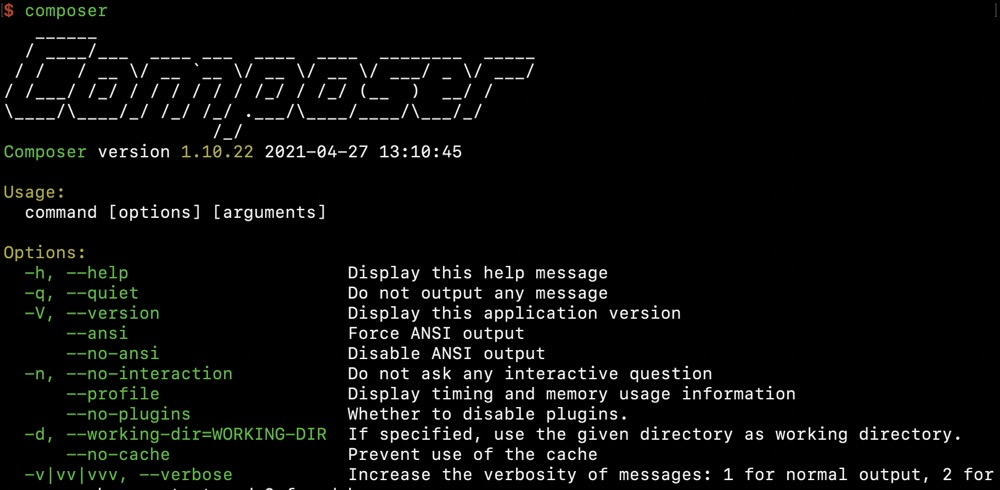

# Laravel

## 一、搭建环境

Laravel是PHP的一个Web框架，本次安装的版本是8，需要的PHP版本 >= 7.3.0

`Laravel` 的安装十分简单，首先先安装 `composer`。`composer` 安装教程[官方文档](https://pkg.phpcomposer.com/#how-to-install-composer)已经详细介绍，这里不多赘述。



<br>

### 1.1 安装 Laravel 

命令行直接输入

```shell
composer create-project --prefer-dist laravel/laravel SolutionCase
```

如果上面的指令下载不了，可能是因为国内有墙的存在导致连接超时了

我们可以将 `composer` 资源获取地址改为国内的镜像，如下命令（推荐使用阿里云的镜像）

```shell
$ composer config -g repo.packagist composer https://mirrors.aliyun.com/composer
```
然后重新执行下载的命令

安装完成。

<br>

### 1.2 本地开发环境

如果你在本地安装了 PHP，并且你想使用 PHP 内置的服务器来为你的应用程序提供服务，则可以使用 Artisan 命令 serve。该命令会在 http://127.0.0.1:8000 上启动开发服务器：

```shell
$ php artisan serve
```

<br>

访问  http://127.0.0.1:8000 ，如下所示。


 

## 二、路由
### 2.1 什么是路由？

路由发生在 `OSI ` 网络参考模型中的第三层即网络层，简单地说就是接受 `http` 请求的路径并和程序交互。

我们在 `config/web.php` 创建一个路由，让它返回一段信息，并设置响应的 url 地址； 

```php
Route::get('index', function () { 
	return 'Hello, World!'; 
}); 
```

<br>

⚠️ 当然，别忘记启动内置服务器

```shell
$ php artisan serve
```

<br>

访问 `127.0.0.1:8000/index` ，如下所示


在这个路由上，我们使用了 `get()` 这个方法，路由接受的就是 `get` 请求。同理，使用 `post()`、`put()` 、`delete()`， 路由接受的就是 `post`、`put`、`delete` 请求。

**而有没有一种方法是可以让路由接受所有请求的呢？**

有！`any()` 不管是什么请求方式，全部都接收。

<br>

**那有没有指定接收多种 `http` 请求的路由？**

也有！`match()` 可以指定接收 `http` 请求的类型

```php
Route::match(['get', 'post'], 'index', function () { 
	return 'Hello, World!'; 
}); 
```

<br>

在路由的规则和闭包区域，我们可以设置和传递路由参数。

```php
Route::get('index/{id}', function ($id) { 
  return 'Hello, World!'.$id; 
});
```

访问 `http://127.0.0.1:8000/index/123456`


上面的例子中，`{id}` 表示在 `url` 中的动态参数。

<br>

### 2.2 创建控制器

我们可以在项目的根目录命令行处，敲下

```shell
$ php artisan make:controller Laravel/TestController
```

控制器目录在 `app\Http\Controllers`  下，上述命令会在 `app\Http\Controllers `目录下创建 `Laravel/TestController.php`  控制器。


<br>

使用该方法创建 控制器，会自动生成命名空间

```php
<?php

namespace App\Http\Controllers\Laravel;

use App\Http\Controllers\Controller;
use Illuminate\Http\Request;

class TestController extends Controller
{
    public function index(){
        return "index";
    }

    public function read($id){
        return "id:".$id;
    }
}
```

<br>

**通过配置路由来访问创建好的控制器。**

在 `config/web.php` 中添加

```php
Route::get('/index', 'App\Http\Controllers\Laravel\TestController@index');
Route::get('/read/{id}', 'App\Http\Controllers\Laravel\TestController@read');

# 或者以路由组的形式

Route::group(['namespace' => 'App\Http\Controllers\Laravel'],function (){
    Route::get('/index', 'TestController@index');
    Route::get('/read/{id}', 'TestController@read');
});
```

<br>

### 2.3 路由参数

**对路由进行参数约束**

在 [2.1 什么是路由？](# 2.1 什么是路由？) 章节里，最后的例子里我们使用了 动态参数，有时候对于这些参数，需要做一些限制，我们可以使用正则表达式来限制必须是 数字。


