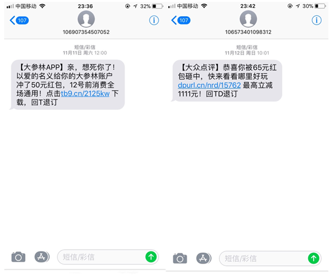
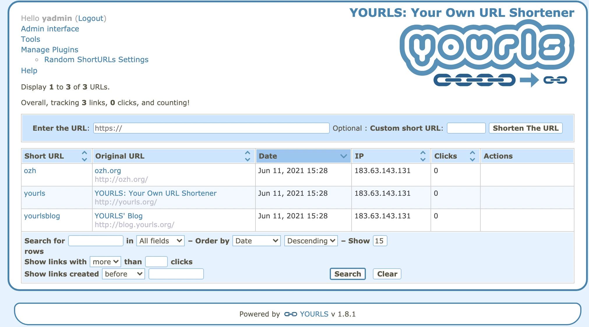

# Short Link 短链服务

## 一、为什么需要短链服务
短链接广泛应用在短信的营销等业务，我们经常能收到类似如下的营销短信。而这些链接🔗基本都是短链接，使短信内容更短，形式上更美观，更易于阅读。



另外，某些类似 Twitter、新浪微博 的微博客服务对于每条贴子或消息有字数限制，超过该字数限制是不被该服务允许的，因此，需要通过缩短网址的功能来达到网址缩短的目的。

当然，市面上短链服务也是五花八门，比如[百度短链](https://dwz.cn/)、[bitly](https://bitly.com/) 等，但是是收费的，有兴趣的小伙伴可以评估一下短链收费服务或者自行搭建短链系统的成本，再决定是否需要搭建。

<br>

## 二、如何实现一个短链服务
短链接，通俗来说，就是将长的URL网址，通过程序计算等方式，转换为简短的网址字符串。

如果创建一个短链系统，我们应该做什么呢？

- 将长链接变为短链，越短越好。
- 用户访问短链接，会跳转到正确的长链接上去。查找到对应的长网址，并跳转到对应的页面。
- 具备持久化、超时失效、稳定跳转等功能。

<br>

## 三、基于 Yourls 搭建的短链系统

`Yourls` 是 `GitHub` 开源免费的短链系统。地址：https://github.com/YOURLS/YOURLS

- 安装

```shell
git clone https://github.com/YOURLS/YOURLS.git
```

<br>

- 配置 `nginx`

  `Yourls` 支持多种服务器，详情可以看 [wiki](https://github.com/YOURLS/YOURLS/wiki)，本次使用 `nginx` 配置，`nginx.conf` 配置文件如下：

```conf
server {

  # HTTP over IPv4 & IPv6
  listen 80;
  listen [::]:80;

  # HTTPS over IPv4 & IPv6
  # MUST BE EDITED TO REFLECT YOUR CONFIGURATION
  #listen 443 ssl;
  #listen [::]:443 ssl;
  #ssl_certificate     yourls.com.crt;
  #ssl_certificate_key yourls.com.key;

  # Server names
  # MUST BE EDITED TO REFLECT YOUR CONFIGURATION
  server_name yourls.com www.yourls.com;

  # Root directory
  # MUST BE EDITED TO REFLECT YOUR CONFIGURATION
  root /Users/wangqing/Documents/project/yourls;

  # Rewrites
  location / {
     try_files  $uri  $uri / /youurls-loader.php $is_args$args ;
  }

  # PHP engine
  location ~ \.php$ {
    include fastcgi.conf;
    # OR
    # include fastcgi_params;
    
    fastcgi_index index.php;
    
    # MUST BE EDITED TO REFLECT YOUR CONFIGURATION
    fastcgi_pass 127.0.0.1:9000;
  }
}
```

详细配置参考：https://github.com/YOURLS/YOURLS/wiki/Nginx-configuration

<br>

- 配置 host

```shell
127.0.0.1   yourls.com
127.0.0.1   www.yourls.com
```

<br>

- 访问 `http://www.yourls.com/admin/index.php`



当进行到这一步的时候，就可以使用 `Yourls` 的短链功能了，但是我觉得仍然需要加一些插件。

比如：英文不好的同学可以更换一下语言，`Yourls` 支持部分语言的国际化，[详情看这里](https://github.com/YOURLS/YOURLS/wiki/YOURLS-in-your-language)。

<br>


